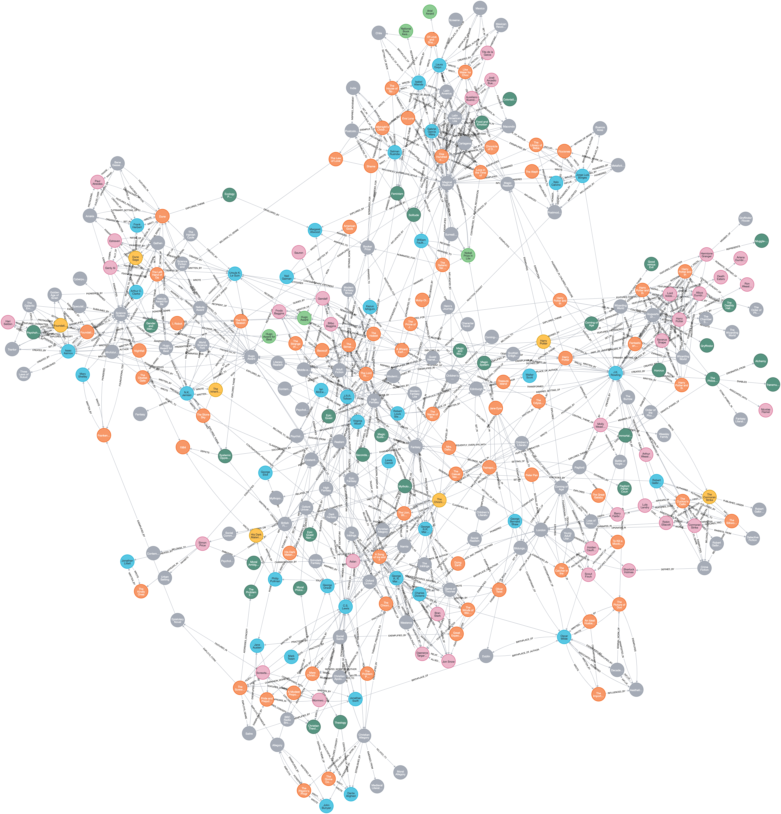

# 📚 Bookshelf Knowledge Graph & Recommendation Engine

An end-to-end, open-ended literary knowledge elicitation pipeline heavily inspired by the academic **GPTKB** framework. 
This system autonomously transforms unstructured literary facts into a dense, property-mapped graph database inside Neo4j to power explainable, multi-hop book recommendations.

<p align="center">
  
</p>

## 🚀 Overview

Traditional book recommendation engines rely on statistical collaborative filtering, which suffers from severe cold-start limitations (new or niche books get ignored) and forces users into predictive "filter bubbles." This project approaches discovery through **Semantic Knowledge Graphs** and **Domain-Specific Logic Elicitation**. 

Using a high-performance concurrent orchestration engine, the system directs an LLM to systematically trace open-ended factual triples across literature—mapping books, authors, characters, settings, genres, and historical movements into a high-density database. By tracking relationship paths natively (e.g., `Book A` -> `INFLUENCED_BY` -> `Author B` -> `WROTE` -> `Book C`), the downstream recommendation engine can provide human-readable, explainable reasoning alongside its results.

## 🛠️ Architecture Highlights

* **High-Performance Multi-Threading**: Features an asynchronous task runner powered by Python’s `ThreadPoolExecutor`. It implements an atomic, thread-safe synchronized node sieve (`in_flight_lock`) to manage background tasks gracefully and guarantee zero duplicate entity expansions across workers.
* **Cost-Minimized Ingestion Layer**: Optimized to use `claude-3-5-haiku-20241022` with compressed JSON property maps (e.g., swapping verbose structural keys for compact tokens like `yr`, `desc`, `t_name`). This controls output word volume and slashes live API extraction token bills by ~75% compared to monolithic models.
* **Pre-Seeded Schema Initialization**: Prevents empty-database "chicken-and-egg" bootstrapping bugs by programmatically creating unique database schema constraints on critical structural labels before initializing the asynchronous processing loop.
* **Defensive JSON Sanitization**: Implements robust response post-processing to strip out accidental markdown code blocks (` ```json ... ``` `) and conversational fluff emitted by the LLM, maintaining continuous uptime during large crawls.
* **Offline Relation Clustering Maintenance**: Features an analytical post-processing step using a local, lightweight Sentence-Transformer (`all-MiniLM-L6-v2`) and Agglomerative Clustering. It groups and merges divergent, semantically identical edge properties (e.g., collapsing `PENNED_BY`, `AUTHORED_BY`, and `CREATED_BY` down into a single canonical `WRITTEN_BY` attribute) directly on a local CPU to ensure clean, predictable data for recommendation queries.

---

## 🏗️ Execution Pipeline & Data Flow
[Empty Neo4j Canvas]
│
▼ (Run constraint initialization)
[Seeded Target Labels] ──► (Trigger ThreadPool Queue) ──► [Query Claude 3.5 Haiku]
│
┌──────────────────────────────────────────────────────────┘
▼
[Defensive JSON Stripper] ──► [Upsert Graph Triples] ──► [Queue Next Leaf Nodes (crawled=false)]
│
┌──────────────────────────────┘
▼ (Run Maintenance Cycle)
[Sentence-Transformer Clustering] ──► [Consolidate Messy Relations into Canonical Taxonomy]

--

## 🚦 Quick Start
🚧 **WORK IN PROGRESS** 🚧  
*Installation guides, dataset setups, and execution sequences for the recommendation engine are currently being finalized.*

## 📜 Repository Structure
├── README.md               # Project documentation and architectural overview
├── ingest.py               # Concurrent multi-threaded LLM elicitation and graph generation script
├── cluster_relations.py    # Offline semantic clustering and taxonomy merging engine
├── requirements.txt        # System library requirements (anthropic, neo4j, sentence-transformers, sklearn)
└── .env.example            # Template for pipeline infrastructure and API access variables


